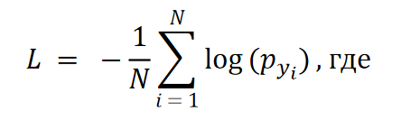
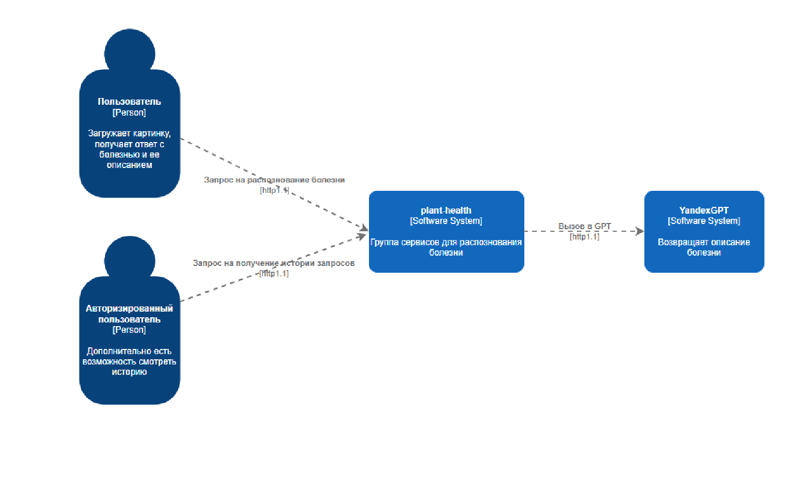
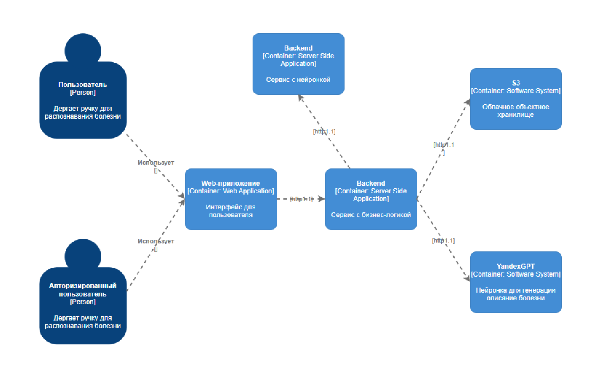
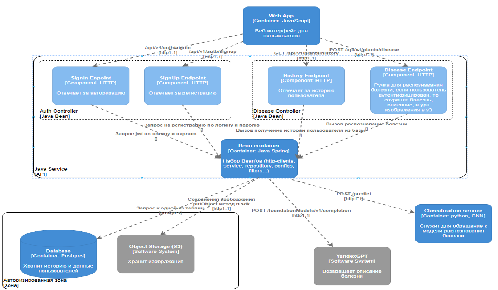

# Plants-health

## Ссылка на презентацию проекта

[Презентация проекта](Presentation.pdf)

## Участники проекта и их обязанности

| **ФИО**                      | **Группа**      | **Обязанности**                                                                                          |
|-------------------------------|-----------------|----------------------------------------------------------------------------------------------------------|
| Павловский Алексей Валерьевич | М8О-410Б-21     | Анализ литературы, обучение модели классификации, настройка взаимодействия сервера и модели, оформление документации, создание презентации |
| Катин Иван Вячеславович       | М8О-410Б-21     | Разработка backend части web-приложения, реализация внутренней логики сервера, настройка работы инфраструктуры cloud.ru, развертывание виртуальной машины, оформление документации |
| Желанов Даниил Вячеславович   | М8О-410Б-21     | Разработка frontend части web-приложения, проработка дизайна, развертывание виртуальной машины, реализация API, дебаггинг кода, оформление документации |

---

## Описание проекта
Мы разработали систему для автоматического выявления заболеваний растений по изображениям листьев. Для этого была использована модель, основанная на модифицированной архитектуре ResNet9 с остаточными блоками, которые повышают производительность и эффективность.

Решение помогает фермерам и агрономам оперативно определять болезни и принимать меры для их устранения. Помимо анализа изображения, пользователи получают полезную текстовую информацию через ответ от YandexGPT.

---

## Запуск проекта

1. Склонировать репозиторий:

```
git@github.com:JlacTo4Ka/Plants-health.git
```

2. 

```
docker pull plants-health.cr.cloud.ru/ml(backend, front)
```

3. 

```
docker-compose --env-file .env -d up
```

## Цели проекта

### Цель машинного обучения (ML):
- Разработать модель классификации, которая определяет, здорова ли культура или какой тип заболевания присутствует.
- Достичь высокой точности (более 95%) на тестовом наборе данных.
- Обеспечить быструю и качественную обработку запросов пользователей.

### Бизнес-цель:
- Снизить расходы на диагностику заболеваний.
- Увеличить урожайность за счет своевременного выявления проблем с растениями.
- Автоматизировать процесс мониторинга состояния растений.

---

## Что такое классификация?
Классификация — это задача машинного обучения, при которой модель предсказывает категорию (класс) для входных данных. Цель классификации в этом проекте:
1. Определение здоровья растения (здоровое/больное).
2. Распознавание конкретного заболевания на основе изображений листьев.

Модель обучается на наборе данных изображений, где каждая картинка имеет метку (название заболевания или "здоровое"). После обучения модель способна анализировать новые изображения и предсказывать, к какому классу они принадлежат.

---

## Функция потерь
Для обучения модели использовалась **Cross-Entropy Loss (кросс-энтропия)** — основная функция потерь для многоклассовой классификации. 

### Формула:


Где:
- \(L\) — значение функции потерь.
- \(N\) — количество примеров в одном батче.
- \(p_{y_i}\) — предсказанная моделью вероятность для истинного класса.
- \(y_i\) — истинный класс для \(i\)-го примера.

---

## Dataset
Мы использовали **New Plant Diseases Dataset (Augmented)** для обучения модели. 

### Характеристики датасета:
- **Количество классов:** 38 (комбинации названия растения и состояния, например, "Apple___Scab").
- **Растения:** 14 видов.
- **Заболевания:** 26 видов.
- **Общее количество изображений:**
  - ~87,000 для обучения.
  - ~21,000 для валидации.
- **Количество изображений на класс:** В среднем ~2300.
- **Распределение:** Почти равномерное, что делает датасет сбалансированным.

---

## Архитектура ResNet9
Для решения задачи классификации изображений листьев растений была выбрана архитектура **ResNet9**, которая сочетает остаточные связи и свёрточные блоки.

### Структура модели:
1. **Первые свёрточные блоки (ConvBlock1 и ConvBlock2):**
   - Извлечение низкоуровневых признаков (края, текстуры, цветовые паттерны).
   - Используют свёрточные операции, нормализацию (BatchNorm2d) и активацию ReLU.

2. **Средние слои (ConvBlock3, ConvBlock4 и Res1):**
   - Кодируют более сложные текстуры и формы, характерные для конкретных заболеваний.
   - Остаточные блоки позволяют сохранять и комбинировать признаки из предыдущих слоев.

3. **Последние слои (Res2 и классификатор):**
   - Обрабатывают высокоуровневые признаки (структура, контекст изображения).
   - Классификатор включает MaxPooling, Flatten и полносвязный слой для классификации на 38 классов.

### Преимущества ResNet9:
- Эффективное обучение за счёт остаточных связей.
- Высокая производительность при сравнительно небольшой сложности.
- Быстрое обучение по сравнению с более глубокими сетями (ResNet50, ResNet101).

---

## Результаты
- **Точность:** 99% на валидационном наборе данных.
- **Функция потерь:** Очень низкое значение:
  - Epoch [0]: `train_loss: 0.7574`, `val_loss: 0.5515`, `val_acc: 83.64%`.
  - Epoch [1]: `train_loss: 0.1251`, `val_loss: 0.0274`, `val_acc: 99.16%`.
- **Время обучения:** ~33 минуты.

---

## Архитектура

Ниже продемонстрированы архитектурные схемы (стандарт С4)

1. Контекст: Показывает взаимодействие пользователей и внешних систем с приложением.



2. Контейнеры: Описывает верхнеуровневую архитектуру.



3. Компоненты: Углублённое описание каждого контейнера.



4. Код: Включает структуру ключевых частей кода.

```
/root
├── frontend/                     	# Каталог с фронтендом
│   ├── css/                     	# Стили для пользовательского интерфейса
│   │   └── style.css             # Основной файл стилей
│   ├── js/                       	# Скрипты для взаимодействия
│   │   └── script.js             	# Основной файл скрипта
│   └── index.html               	# Главная HTML-страница
├── backend/                      	# Каталог с серверной частью
│   ├── aop/                     	# Каталог для обработки исключений
│   ├── config/                   	# Конфигурации приложения
│   ├── controller/               	# Контроллеры API
│   ├── dto/                      	# Объекты передачи данных
│   ├── model/                   	# Модели данных
│   ├── repository/               	# Репозитории для работы с базой данных
│   ├── service/                 	# Логика приложения
│   ├── util/                     	# Вспомогательные утилиты
│   ├── BackendApplication.java   # Точка входа в приложение
│   ├── build.gradle              # Файл конфигурации Gradle
│   └── settings.gradle          # Настройки Gradle
├── ml/                           	 # Каталог с ML моделью
│   ├── Dockerfile                # Сборка контейнера для ML
│   ├── handler.py                 # Основной файл для запуска ML модели
│   ├── plant-disease-model.pth   # Модель классификации
│   ├── plant-disease-model-complete.pth  # Полная модель
│   └── requirements.txt          # Зависимости для ML
└── docker-compose.yml            # Оркестрация контейнеров

```

## Обоснование архитектуры

- Архитектура проекта построена с учетом модульности, асинхронности и необходимости высокой производительности. Это обеспечивает надежность системы, легкость масштабирования и возможность интеграции новых функций. Выбор технологий основан на функциональных требованиях проекта и их преимуществ в реализации задач классификации заболеваний растений. Ниже приводится обоснование архитектурных решений и выбора технологий.

- Язык программирования: Java
   - Java был выбран для реализации серверной части из-за быстроты разработки на фреймворке Spring Boot, поскольку он предоставляет эффективные инструменты для реализации REST API, работы с базой данных и обеспечения безопасности. Ко всему прочему у нас имеется опыт разработки приложений на данном ЯП.

   Мы выбрали Java, а не, например, Python, потому что Python удобен для разработки ML-моделей, но для серверной части он менее эффективен из-за своей однопоточности и меньшей производительности.

- ML-фреймворк: PyTorch
   - PyTorch был выбран для разработки и обучения модели классификации заболеваний растений (ResNet9) благодаря своей гибкости и производительности. Этот фреймворк предоставляет богатый инструментарий для работы с глубокими нейронными сетями.

   Мы выбрали PyTorch, а не TensorFlow, потому что PyTorch предлагает более простой и гибкий подход к обучению моделей. Это особенно важно при необходимости быстро тестировать и модифицировать архитектуры.

- Обработка изображений: ResNet9
   - Архитектура ResNet9 выбрана для классификации изображений растений. Она эффективно обрабатывает визуальные данные благодаря остаточным связям, позволяющим сохранять важные признаки на разных уровнях абстракции.

   Мы выбрали ResNet9, а не VGG16, потому что VGG16 имеет большую сложность и требует больше времени на обучение. ResNet9 предоставляет сопоставимые результаты с меньшими вычислительными затратами.

- Облачная инфраструктура: Cloud.ru (Evolution)
   - Cloud.ru предоставляет удобную и производительную облачную инфраструктуру, которая позволяет масштабировать проект в зависимости от нагрузки. Высокая доступность сервиса обеспечивает бесперебойную работу бота.

   Почему не Yandex Cloud или подобные инфраструктуры? Cloud.ru предлагает более доступные тарифы и в целом лучше.

- Объектное хранилище: S3 Evolution Object Storage
   - Объектное хранилище используется для долговременного хранения изображений и данных. S3 Evolution поддерживает управление большими объемами данных, предоставляя быстрый доступ и возможность масштабирования.

   В отличие от локального хранилища, где сложно масштабировать и обеспечить высокую доступность данных.

- Асинхронность
   - Асинхронные процессы: Изображения загружаются в облачное хранилище S3 и обрабатываются параллельно с запросами к модели и YandexGPT.

- Обоснование дополнительных технологий
   - YandexGPT: Внешний API для генерации текстовых описаний заболеваний растений, интеграция позволяет повысить ценность предоставляемых данных.
   - PostgreSQL: Мы выбрали РСУБД Postgres, а не NoSql базу (например Cassandra, Mongo), так как у нас нет изменений схемы, схема данных простая, нет потребности репликации и создания высоконагруженной БД. Поэтому в нашем кейсе больше подходит более простой вариант, как PostgreSQL.

---

## Стек технологий

## Технологический стек проекта

| **Компонент**              | **Технология**                 | **Обоснование**                                                                 |
|----------------------------|--------------------------------|---------------------------------------------------------------------------------|
| **Язык программирования**  | Java                          | Высокая производительность, надежность, масштабируемость для серверной части.  |
| **ML-фреймворк**           | PyTorch                       | Гибкость, простота настройки и высокая производительность при работе с нейронными сетями. |
| **Фреймворк для сервера**  | Spring Boot                   | Удобная разработка REST API, интеграция с базой данных и встроенные механизмы безопасности. |
| **Оркестрация**            | Docker                        | Для изоляции компонентов, удобной развертки и масштабирования приложения.      |
| **База данных**            | PostgreSQL                    | Реляционная база данных с поддержкой сложных запросов и надежным хранением.    |
| **Объектное хранилище**    | S3 Evolution Object Storage   | Надежное хранение изображений с быстрым доступом и масштабируемостью. Быстрая интеграция с Cloud.ru |
| **Генерация текста**       | YandexGPT                    | Генерация полезных текстов на основе результатов анализа изображений.          |
| **Облачная инфраструктура**| Cloud.ru                      | Высокая доступность и производительность для размещения серверной части.       |
